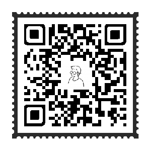
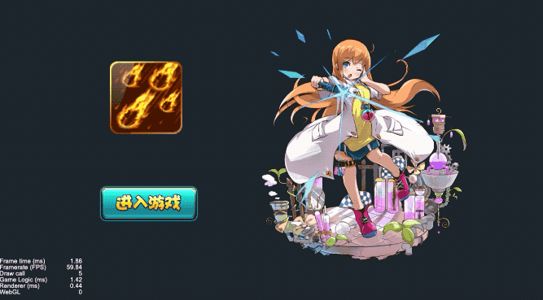
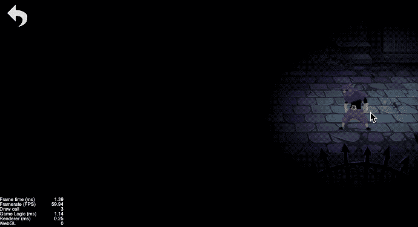

# cocos-awesome
cocos是一款挺棒的游戏引擎，我在这个仓库实现一些游戏当中比较使用的功能模块，对应的一个功能一个场景，用的引擎版本是`v2.3.0`，实现的思路在`doc`目录中。

# 目前已实现效果

[水波扩散（shader）](./doc/Water_spread/水波扩散效果.md)
[镜面光泽（shader）](./doc/Specular_gloss/镜面光泽.md)
[圆形头像（shader）](./doc/Circle_avatar/shader圆形头像.md)
[溶解效果（shader）](./doc/Dissolve_color/溶解效果.md)
[刮刮卡实现](./doc/Scratch_ticket/Scratch_ticket.md)
[金币落袋效果](./doc/Coin_fly_to_wallet/金币落袋效果.md)
[放大镜效果](./doc/Magnifying_mirror/局部放大效果.md)
[追光效果（shader）](./doc/Follow_spot/追光效果.md)
[打字机效果](./doc/Typer/打字机效果.md)
[子弹跟踪效果](./doc/Bullet_Tracking/子弹跟踪效果.md)
[移动残影效果](./doc/Moving_ghost/Moving_ghost.md)
[背景无限滚动](./doc/Infinite_bg_scroll/背景无限滚动.md)
[遥控杆](./doc/Joystick/遥控杆.md)
2D换装
震屏效果+动画恢复第一帧

# 预览二维码

## 水波扩散（shader）
水波扩散是一个比较好看的交互效果，特别是在某些以水为故事发生场景的游戏中，扩散的水波会让场景更加栩栩如生。

## 镜面光泽（shader）
镜面上扫过一道光泽是UI里面很常用的一种特效，通常用来强调某个物体或者凸显物体的“稀有”价值，比如卡片中扫过一道光芒等

## 追光效果（shader）
追光效果是在舞台全场黑暗的情况下用光柱突出角色或其他特殊物体，通过人为操控光源跟随人物移动，主要用来突出角色主体以及主体和环境的关系。在游戏中可以用来突出氛围以及聚焦玩家视线焦点，不仅可以用来营造沉浸式氛围，也可以用在解谜或者找物品等类别的游戏中。

## 溶解效果（shader）
物体的淡入淡出是游戏当中很常见的一种状态切换效果，但是有时候我们希望`fade`切换的时候，物体能够能更有色彩层次感或者其他一些特殊的中间状态，这个时候就得自己去写着色器，这种区别于单纯的淡入和淡出的效果可以形象地叫做溶解。

## 圆形头像（shader）
圆形头像在creator中没有提供，但是这个又是个比较高频的使用功能。

## 刮刮卡实现
奖券，优惠券什么的就需要用到刮刮卡的效果了，大家生活里都使用过。

## 金币落袋效果
金币从初始点散开然后逐个飞落到指定的位置，这是游戏里面很常用的一个动画，效果如下

## 放大镜效果
对画面的某个位置进行放大和缩小，是某些类型游戏里面必不可少的功能，比如常见的地图缩放，局部细节放大等等。它核心是对相机应用，异名基于此实现一个放大镜的demo

## 打字机效果
打字机效果也就是让文字逐个在屏幕中显示，直到把整段话说完，常常被应用到人物对话，角色旁白甚至引导教程等高频场景中。

## 子弹跟踪效果
打击的目标一直在移动，但是子弹却像长了眼睛一样在后面尾随，直到精准击中目标。这种“长了眼睛的子弹”，是打击类游戏中比较经典的武器之一。

## 移动残影效果
游戏中的人物移动带起残影，用来表达速度是很有视觉表现力的。异名的实现思路是从“白玉无冰”那里照搬过来的，在具体的实现上面添加了一些异名自己的理解。

## 背景无限滚动
这是游戏里面很常用的一个功能模块，它就像你的生活，有着走不完的路程。它的实现也很简单，要么做一个很长的背景图，然后移动相机；要么就是实现一个跑马灯，像那些轮播图什么的，大家应该都有写过。

## 遥控杆
这是游戏里面很常用的一个功能模块，它就像你的生活，有着走不完的路程。它的实现也很简单，要么做一个很长的背景图，然后移动相机；要么就是实现一个跑马灯，像那些轮播图什么的，大家应该都有写过。

