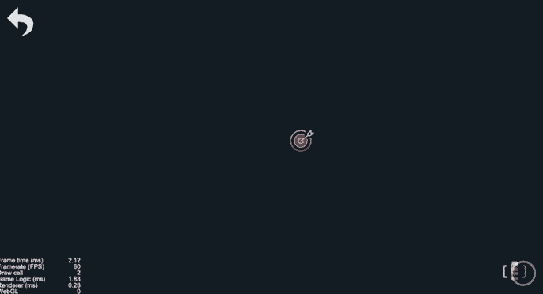
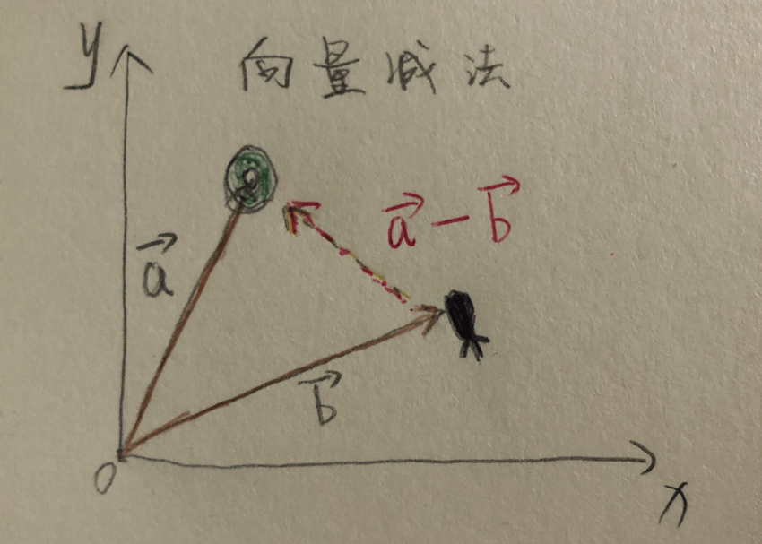
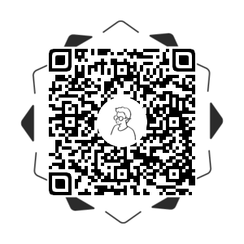

# 效果演示

打击的目标一直在移动，但是子弹却像长了眼睛一样在后面尾随，直到精准击中目标。这种“长了眼睛的子弹”，是打击类游戏中比较经典的武器之一。



# 实现思路

首先要排除掉用的动画来实现，因为我们的目标在实时地移动，所以子弹的终点位置是不确定的，同时在移动的时候，我们的子弹的方向也需要进行实时的调整，整个过程中起点和终点不确定，运动过程也不确定，因此整个过程不能用一个动画过程去模拟。

但是我们可以在`update`的时候去实时改变子弹的方向和处理速度变化。在每帧的回调中，我们可以拿到当前目标的位置和子弹的位置，然后我们通过向量减法，算出子弹到目标的归一化向量，然后再给子弹做位置的叠加和角度的叠加。



这里面涉及到两个向量处理，一个是向量减法，如上图所示，它的意义应该不难理解，就是表达了子弹到目标的这个过程。还有一个处理叫做`归一化向量`，简单点说就是单位长度为1的向量，因此也把它叫单位向量或者标准向量，对于大部分向量而言，我们只关心向量的方向，而不在意向量的长度，这种情况下就适合用单位向量来表示，比如光线的入射方向、反射的方向等，当然还有我们这个例子中用到的“跟踪子弹”，要实现这个功能，我们要做的就是让子弹能够朝目标的方向去运动，而运动的步长就是我们自己自定义的速度，实现代码如下：

```js
bulletSpeed = 200;
update(dt) {
  if (!this.fireFlag) return;

  let targetPos: cc.Vec2 = this.target.getPosition();
  let bulletPos: cc.Vec2 = this.bullet.getPosition();
  let normalizeVec: cc.Vec2 = targetPos.subtract(bulletPos).normalize();

  this.bullet.x += normalizeVec.x * this.bulletSpeed * dt;
  this.bullet.y += normalizeVec.y * this.bulletSpeed * dt;
  // 角度变化以y轴正方向为起点，逆时针角度递增
  this.bullet.angle = cc.v2(0, 1).signAngle(normalizeVec) * 180 / Math.PI;

  let rect = this.target.getBoundingBox();
  if (rect.contains(bulletPos)) this.hitTheTarget();
}
```

因为节点的角度是以y轴正方向为起点，逆时针递增，所以在计算子弹的角度的时候，可以使用`cc.v2(0, 1).signAngle(normalizeVec)`算出当前向量和y轴夹角的弧度，然后再转化成角度赋值。

## 效果预览

源码获取请点击**查看原文**，长按二维码查看效果👇




