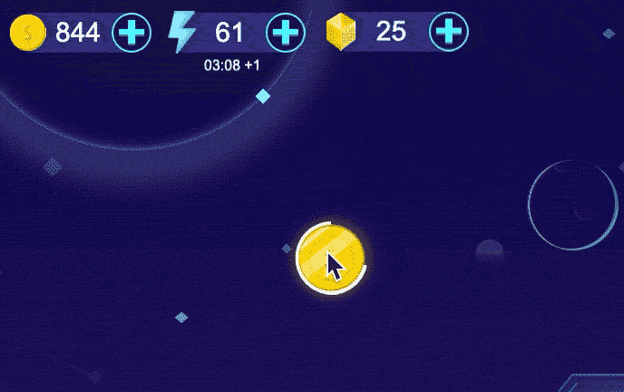
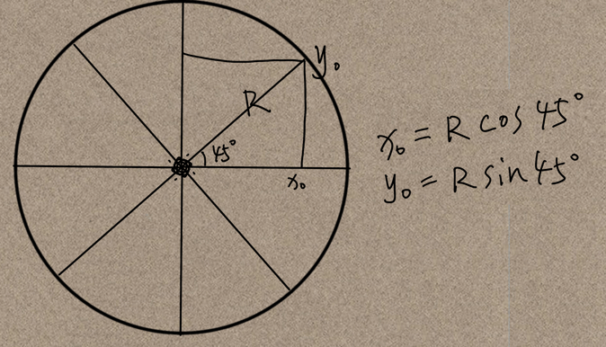
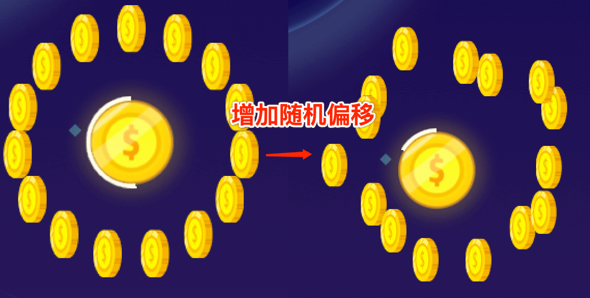
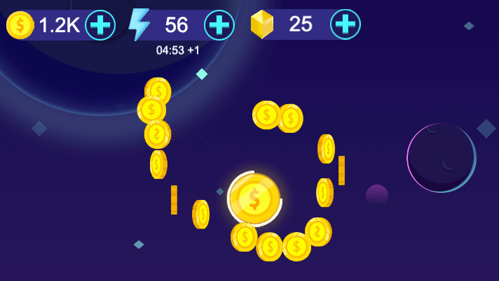

# 效果演示
金币从初始点散开然后逐个飞落到指定的位置，这是游戏里面很常用的一个动画，效果如下


# 实现思路
要实现这个效果，我们已知三个条件，分别是起点位置，终点位置，金币个数。

## 生成金币位置
金币散开的位置看起来很随机，但是经过我们的拆解，其实它的第一步是先生成一个标准的圆。假设我们现在是8个金币，我们知道起点的坐标，如何求这8个金币的散开位置呢，这其实是一个数学问题。
`8`个金币平分一个圆，每个金币夹角是`360度 / 8 = 45度`，假设圆的半径`r`是确定的，我们又知道圆心的坐标，结合三角函数我们就能够很轻易算出每个金币的位置。


当我们拥有每一个金币的标准位置之后，再给它们每个的位置叠加一个随机偏移，这样子他们的位置看起来就是围绕着起点做随机分布



以上代码如下
```js
/**
 * 以某点为圆心，生成圆周上等分点的坐标
 *
 * @param {number} r 半径
 * @param {cc.Vec2} pos 圆心坐标
 * @param {number} count 等分点数量
 * @param {number} [randomScope=80] 等分点的随机波动范围
 * @returns {cc.Vec2[]} 返回等分点坐标
 */
getCirclePoints(r: number, pos: cc.Vec2, count: number, randomScope: number = 60): cc.Vec2[] {
  let points = [];
  let radians = (Math.PI / 180) * Math.round(360 / count);
  for (let i = 0; i < count; i++) {
    let x = pos.x + r * Math.sin(radians * i);
    let y = pos.y + r * Math.cos(radians * i);
    points.unshift(cc.v3(x + Math.random() * randomScope, y + Math.random() * randomScope, 0));
  }
  return points;
}
```


## 金币落袋
拆分效果可以看到，金币落袋的过程中还有先后的顺序，我们在实现的时候先计算一下每个金币到袋子的距离，然后做个排序，让距离袋子近的金币先执行进袋的动画，远的后执行。

代码的实现如下：
```js
goldNodeList.sort(node => node.dis);

goldNodeList.forEach((node, idx) => {
    node.gold.runAction(cc.sequence(
        cc.moveTo(0.3, node.startPoint),
        cc.delayTime(idx * 0.03),
        cc.moveTo(0.6, node.endPoint),
        cc.callFunc(() => {
            this.goldPool.put(node.gold);
        })
    ))
});
```

## 效果预览

源码获取请点击**查看原文**，长按二维码查看效果👇


