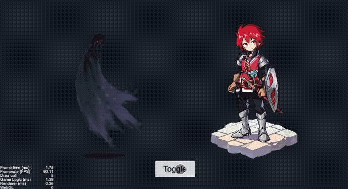

# 效果演示

物体的淡入淡出是游戏当中很常见的一种状态切换效果，但是有时候我们希望`fade`切换的时候，物体能够能更有色彩层次感或者其他一些特殊的中间状态，这个时候就得自己去写着色器，这种区别于单纯的淡入和淡出的效果可以形象地叫做溶解。



# 实现思路

溶解效果的思路很简单，先获取到当前贴图的色彩，然后定义一个对照维度，大部分情况下就取rgb的某一色彩通道就可以了，比如异名demo中的色调偏蓝色调，异名的对比值就取rgb中的blue，然后动态去改变该维度的参考值，当纹理贴图的色块blue值小于该参考值的时候就去色。当参考值变为0的时候，我们的色彩也就完全溶解掉了。`effect`代码如下：

```c++
void main () {
  vec4 color = vec4(1, 1, 1, 1);

  #if USE_TEXTURE
  color *= texture(texture, v_uv0);
    #if CC_USE_ALPHA_ATLAS_TEXTURE
    color.a *= texture2D(texture, v_uv0 + vec2(0, 0.5)).r;
    #endif
  #endif

  // 当颜色小于溶解的程度，则直接抛弃
  if(color.b < fade_pct) discard;
  gl_FragColor = color;
}

```

如果我们希望溶解更加有层次变化，我们还可以对溶解的边缘做一些处理，比如透明度改变，色彩改变等，这就需要代入我们自己的使用场景中，根据实际的需要去调整，比如异名的demo中，希望溶解的边缘有一些蓝色调的变化：

```js
if(color.b < fade_pct + 0.1) {
  color = vec4(0.92, 0.8, 0.95, color.a);
}
```

然后我们需要在`update`的时候去动态更新并设置`fade_pct`，以达到纹理的溶解效果动态变化：

```js
update(dt) {
  this.fadePct += dt * this.speed;
  this.material.setProperty('fade_pct', this.fadePct));
}
```

以上就是溶解效果的核心思路，完整的代码请通过源码查看。通过demo我们可以看出，不同的贴图的溶解效果和我们的溶解条件是直接关联的，左侧的死神色彩单一，蓝色通道较窄，它的变化过程就比较集中而且快，同时用蓝色调处理溶解的边缘效果的过渡也比较融洽。右边的骑士，色彩比较丰富，用单一的蓝色通道当成溶解条件和过渡就相对来说比较生硬，我们需要视项目的实际情况动态调整。

# 效果预览

源码获取请点击**查看原文**，长按二维码查看效果👇


我是异名，你的阅读是我的动力


