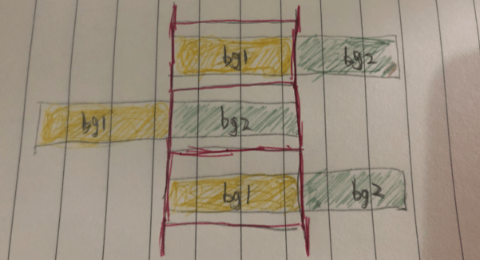
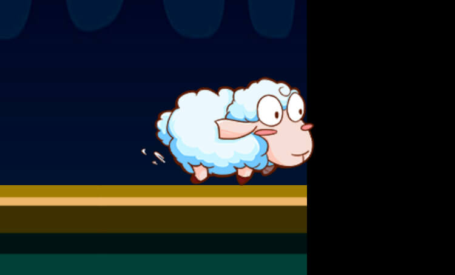

# 效果演示

这是游戏里面很常用的一个功能模块，它就像你的生活，有着走不完的路程。它的实现也很简单，要么做一个很长的背景图，然后移动相机；要么就是实现一个跑马灯，像那些轮播图什么的，大家应该都有写过。


# 实现思路

## 背景无缝切换实现

这个demo的实现思路是跑马灯。背景是两张一样的背景图，第一张图在前，第二张图在后，两张图同时移动，当第一张图正好移动到出屏幕的时候，第二张图正好移进屏幕，这个时候复原两张图的初始位置。这个过程不停循环就有走不完的路程了。



代码如下
```js
speed: number = 500;
update(dt) {
  const temp = dt * this.speed;
  if (this.bg2.x - temp <= 0) {
    this.bg1.x = this.bg2.x;
    this.bg2.x = this.bg1.x + this.bg1.width;
  }

  this.bg1.x -= temp;
  this.bg2.x -= temp;
}
```

## 全屏适配

因为是整个背景都在跑动，所以两个背景节点都是需要做`widget`拉伸的，第一张背景上下左右都设置为0就可以了，第二种背景往右再偏移一个屏幕。但是这样是不够的，因为不是所有用户的屏幕都是按我们的设计分辨率来的，所以跑着跑着可能你的背景就露馅了



所以我们在onload的时候还是得手动去对齐一下bg2的位置，因为它在布局编辑器里面只是往右移动了我们的设计分辨率一样宽的距离。(bg1肯定是对的，因为使用了widget对齐了当前屏幕)

```js
onLoad() {
  const viewSize = cc.view.getVisibleSize();
  this.bg2.getComponent(cc.Widget).left = viewSize.width
  this.bg2.getComponent(cc.Widget).right = -viewSize.width
}
```

# 效果预览

源码获取请点击**查看原文**，长按二维码查看效果👇


我是异名，你的阅读是我的动力


