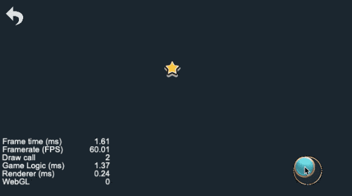
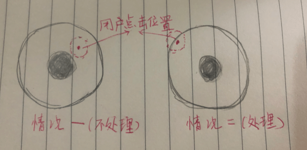
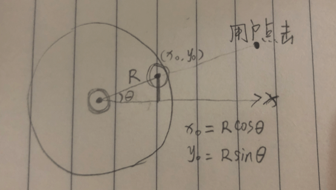
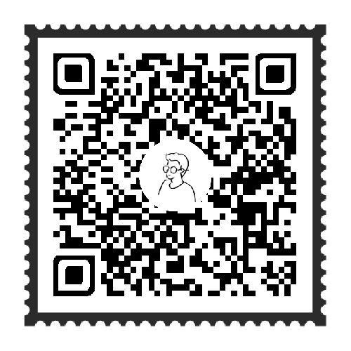

# 效果演示

这是游戏里面很常用的一个功能模块，通过操控遥控杆控制物体的移动



# 实现思路

遥控杆的构造分为中间的控制点和外层的圆形，首先给遥控杆绑定个触控事件，然后在`touch_move`的时候让触控杆保持在圆形中，同时把鼠标的位置偏移信息传给需要移动的物体。

## 控制杆逻辑

用户点击的时候分两种情况，一种是用户的点击位置能够让控制点完全落在圆形内，这个时候让控制点直接移动到用户点击的位置即可；另外一种是用户的点击位置会让控制点会落在圆形外，那就要做一个计算，让控制点的位置维持在圆形内。



这个计算也是很简单，因为我们知道外面圆形的半径，触控点的半径，那它们只要相减就能得出触控点距离圆心最远的距离R。当超过这个距离的时候我们已知斜边是R，同时可以得出用户点击点的向量夹角，那就可以通过三角函数轻易算出控制点的位置。



这个逻辑在`TOUCH_START`和`TOUCH_MOVE`中都需要，以下代码是实现：
```js
touchStartEvent(event) {
  let touchPos = this.node.convertToNodeSpaceAR(event.getLocation());
  const distance = touchPos.len();
  const radius = this.node.width / 2 - this.controlDot.width / 2;

  // 以x轴正方向为基准，计算偏移量
  this.radian = cc.v2(1, 0).signAngle(touchPos);
  const offsetX = Math.cos(this.radian) * radius;
  const offsetY = Math.sin(this.radian) * radius;
  this.controlDot.setPosition(radius > distance ? touchPos : cc.v2(offsetX, offsetY));

  this.movableFlag = true;
}
```

## 物体移动

在用户点击的时候我们已经拿到了用户拖动的方向`radian`，有了方向再加上物体移动的步长，这个其实也就是物体移动的速度，那就可以算出物体在x方向和y方向的移动增量，直接相加即可。
我们可以加一个标志位`movableFlag`，当用户操控控制杆的时候就把这个标志位置为`true`，然后在`update`中根据这个标志位使物体进行位置偏移。

```js
speed: number = 150;
update(dt) {
  if (!this.movableFlag) return;
  this.movableStar.x += Math.cos(this.radian) * dt * this.speed;
  this.movableStar.y += Math.sin(this.radian) * dt * this.speed;
}
```

大多数情况下还需要添加限制条件，让物体的移动不能超出画布，那这就可以通过获取当前屏幕的宽高，然后在计算位置偏移的时候多加一个判断，超出画布就不增加偏移，不超出画布就正常偏移就可以了

# 效果预览

源码获取请点击**查看原文**，长按二维码查看效果👇



我是异名，你的阅读是我的动力


