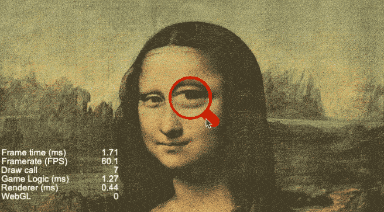
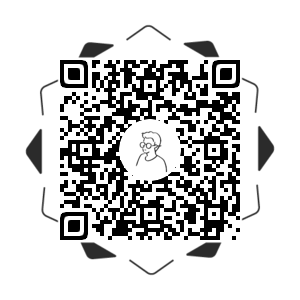

# 效果演示

对画面的某个位置进行放大和缩小，是某些类型游戏里面必不可少的功能，比如常见的地图缩放，局部细节放大等等。它核心是对相机应用，异名基于此实现一个放大镜的demo



# 实现思路
首先要理解相机，和现实的相机一样，相机是用来拍摄画面的，然后生成照片也就是`Texture`，但是引擎内的相机相当于人眼睛，它每一帧都在拍摄画面，可能你没用留意到，我们初始化的每个场景的canvas下都默认有一个`Main Camera`，它就是用来拍摄整个场景的内容，然后投影到画布上的。异名翻了一下以前自己接触`Camera`这个概念的时候的笔记，在这里贴一下：

> 该选择相机那种模式？

根据`camera`的成像原理，一共有两种模式的相机。一种是透视投影，它是锥形的成像模式，是从某个投射中心将物体投射到单一投影面上所得到的透视图，成像效果远小近大，与人们观看物体时所产生的视觉效果非常接近，在做3D场景的时候，就必须用该模式来拍摄3D的画面。另外一种是正交投影模式，也叫"平行投影"，就是把图像通过平行光线投影到画面上，可以理解成一张平面上的画，它就是用来拍摄2D画面的。

> 如果场景内有多个相机，可是屏幕只有一个，这时候这些相机是如何利用屏幕的?

引擎输出画面的时候会把一个—个的相机的图像叠加起来;

> 多个相机的时候，如何确定那个相机先，哪个相机后呢？

相机有一个`depth`属性, `depth`小的先绘制到屏幕, `depth`大的后绘制到屏幕。

> 有多个相机，但是物体是唯一的；多个相机的话，一个物体会被绘制多次?

- 可以通过合理分组给每一个相机选取拍摄具体要拍摄的物体
- 相机会绘制属于自己渲染分组里面的物体

> 如何清除屏幕？

- 相机有—个`clearFlag`如果你设置了，它在绘制画面的时候，会清理屏幕
- 一般只给前面的相机设置`clearFlag`；后面相机都不能再设置，不然会把前面相机绘制的内容清除掉

把思路拉回到放大镜demo中，要实现放大镜，其实就是多创造一个相机去拍摄需要放大的物体，然后调整相机的缩放比例，使投影的物体放大或者缩小对应的倍数，然后配合使用`Mask`组件去裁剪我们需要的局部位置，mask的编辑器设置请参考项目源码，相机初始化代码实现如下：

```js
initCamera() {
  let visibleRect = cc.view.getVisibleSize();

  let texture = new cc.RenderTexture();
  texture.initWithSize(visibleRect.width, visibleRect.height);
  let spriteFrame = new cc.SpriteFrame();
  spriteFrame.setTexture(texture);
  this.mirrorCameraNode.getComponent(cc.Camera).targetTexture = texture;

  this.tempCameraSpriteNode.getComponent(cc.Sprite).spriteFrame = spriteFrame;
  this.tempCameraSpriteNode.scaleY = -1;
}
```

## 效果预览

源码获取请点击**查看原文**，长按二维码查看效果👇




