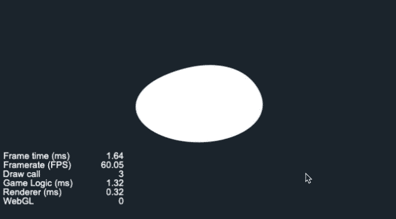
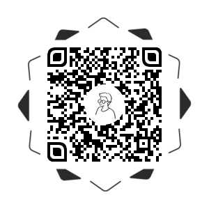

# 效果演示

元球也叫融球，它能够让两个球体产生“黏糊糊”的效果，是流体，融合等效果的实现基础，异名这次实现的demo是一个固定的大圆，然后手指控制一个游离态的小圆



# 实现思路

Metaballs在数学上是一个求等势面的公式，两个球体之间的等势面为`E = R² / (△x² + △y²)`，

```c++
float energy(float r, vec2 point1, vec2 point2) {
  return (r * r) / ((point1.x - point2.x) * (point1.x - point2.x) + (point1.y - point2.y) * (point1.y - point2.y));
}
```

demo的实现很简单，固定的圆处于中心的位置，加大一下半径，求出它的等势面`energy(u_radius + 0.1, v_uv0.xy, vec2(0.5))`，然后我们在手指的落足点再生成一个等势面`energy(u_radius, v_uv0.xy, u_point)`，然后叠加它们，让处于等势面上的点的色值透明度为1，不在该等势面上的透明度为0就可以达到视觉中的球体融合效果：

```c++
void main(){
  vec4 color = texture(texture, v_uv0);

  float fragEnergy = energy(u_radius + 0.1, v_uv0.xy, vec2(0.5)) + energy(u_radius, v_uv0.xy, u_point);
  color.a = smoothstep(0.95, 1.0, fragEnergy);
  gl_FragColor = color;
}
```

这个demo效果异名记得是在一个记账软件上看到的，然后念念不忘，如果你是有心人，你会发现cocos Creator官网的loading动画也是两个球体之间来回改变位置的metaball动画。那如果我们的页面上有更多的小球，让它们互相叠加融球效果，那就可以产生出流体的效果了，异名这两周会抽空实现喔


## 效果预览

源码获取请点击**查看原文**，长按二维码查看效果👇




