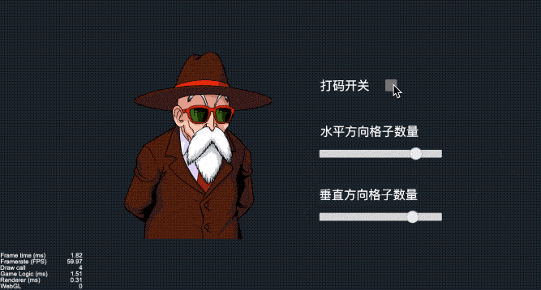

# 效果演示

马赛克是一种常用的图像处理手段，主要功能就是使图像模糊，因为这种模糊看上去有一个个的小格子组，便形象的称这种画面为马赛克。当马赛克越来越小的时候，画面呈现出来的效果也叫像素风



# 实现思路
实现思路就是把图片划分成`M * N`个小格子，格子内取同一个颜色。我们前面经常用到`texture(texture, v_uv0)`这个函数，它的作用就是把纹理贴图按uv进行取样，输出一个`vec4`类型的颜色值，现在实现马赛克效果的时候我们只需要改一下，本来是按uv进行取样的，现在我们改为按`M * N`来取样，我们需要找出每个格子的中心点，然后传入`texture`函数，这样一来问题就变成了，如何计算每个格子的中心点。

从水平方向说起，格子的x轴中心坐标等于当前格子的位置加上格子宽度的一半。水平方向的格子数量`x_count`通过外部传入，我们可以得出每个格子的宽`block_w = 1.0 / x_count`，格子的当前位置等于当前格子的序号乘上格子的宽度，格子的序号为`block_x_idx = floor(v_uv0.x / block_w)`，当前格子的位置为`block_x_idx * block_w`，当前格子的中心点位置为`block_w * (block_x_idx + 0.5)`。同理可以得到格子中心点的垂直方向的位置：

```c++
vec2 getUvMapPos() {
  float block_w = 1.0 / x_count;
  float block_x_idx = floor(v_uv0.x / block_w);

  float block_h = 1.0 / y_count;
  float block_y_idx = floor(v_uv0.y / block_h);

  return vec2(block_w * (block_x_idx + 0.5), block_h * (block_y_idx + 0.5));
}
```

有了映射的坐标，我们就可以直接进行颜色取样和赋值，为了便于控制，我们还可以加上一个宏开关：
```c++
void main () {
  vec4 o = vec4(1, 1, 1, 1);
  vec2 realPos = v_uv0;

  #if USE_MASAIC
    realPos = getUvMapPos();
  #endif

  o *= texture(texture, realPos);
  o *= v_color;

  gl_FragColor = o;
}
```

后面可以通过更改传进来的垂直和水平方向的格子数量来控制马赛克的大小，效果如下：


## 效果预览

源码获取请点击**查看原文**，长按二维码查看效果👇


