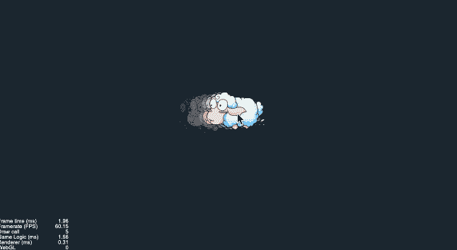
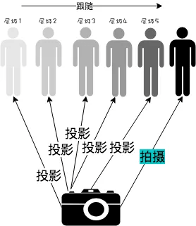

# 效果演示

游戏中的人物移动带起残影，用来表达速度是很有视觉表现力的。异名的实现思路是从“白玉无冰”那里照搬过来的，在具体的实现上面添加了一些异名自己的理解。



# 实现思路

## 投影到多个画布

“白玉无冰”的这张图解析得很清晰，我们在实现的时候会在移动的角色中新建一个独立摄像机的子节点，专门拍摄需要移动的角色，然后投影到五个不同透明度的Sprite中。当角色移动的时候，我们也让作为残影的五个Sprite，分别有延迟地移动到角色当前的位置，这样子在视觉上就有五个残影在跟随了。



在具体的实现有两个注意点，一个是因为摄像机仅仅只需拍摄移动的角色，所以要为角色新建一个分组，相机只拍摄这个分组；还有一个就是相机拍摄出来的画面投影在`RenderTexture`上是一个上下颠倒的镜像图像，所以要设置每个`Sprite`所在节点的`scaleY = -1`；

这块的具体实现上我和白玉无冰的做法不一样，白玉无冰直接在编辑器上对残影所在的`Sprite`节点做上述提到的透明处理、层级管理、颠倒处理，异名会觉得把这块的设置放到代码层面处理比较好，一来是编辑器的功能最好还是专职于布局，比如像这个残影透明参数和层级管理确实可以通过编辑器来配置，但是透明度的细微变化和变量绑定的先后顺序这些微小区别，其实是不利于后面的维护和他人接手的，后面阅读代码逻辑的时候也无法看出整个实现的思路。二来就是在代码内做设置参数可以随时在代码上做调整，比如我的残影透明度的初始值，用代码赋值的方式就会比在编辑器中设置会更加一目了然。

代码如下
```js
const roleZindex = 10;
this.role.zIndex = roleZindex;

const texture = new cc.RenderTexture();
texture.initWithSize(this.node.width, this.node.height);
const spriteFrame = new cc.SpriteFrame();
spriteFrame.setTexture(texture);
this.roleCamera.targetTexture = texture;
this.ghostCanvasList.forEach((ghost, idx) => {
  ghost.node.scaleY = -1;
  ghost.node.zIndex = roleZindex - idx;
  ghost.node.opacity = 100 - idx * 15;
  ghost.spriteFrame = spriteFrame;
});
```

## 角色移动
因为我们的实现是把相机作为子节点绑定在角色节点下面，当角色移动的时候我们的相机也跟着移动了，我们就需要把相机投影所在的`Sprite`节点们分别做一个延时移动，带出”残影“效果。代码如下：

```js
this.schedule(this.ghostFollow, 0.1, cc.macro.REPEAT_FOREVER);
this.node.on(cc.Node.EventType.TOUCH_MOVE, this.touchMoveEvent, this);

touchMoveEvent(evt: cc.Event.EventTouch) {
  this.role.x += evt.getDeltaX();
  this.role.y += evt.getDeltaY();
}

ghostFollow() {
  this.ghostCanvasList.forEach((ghost, i) => {
    const dis = (ghost.node.position as any).sub(this.role.position).mag();
    if (dis < 0.5) return;
    ghost.node.stopAllActions();
    ghost.node.runAction(cc.moveTo(i * 0.04 + 0.02, this.role.x, this.role.y));
  });
}
```
这里注意到，我们并不是在每次`touchMoveEvent`的时候去调用`ghostFollow`函数，而是启用了一个无限重复的定时器去同步，为什么呢？大家去试一试就知道了原因了，其实`cc.Node.EventType.TOUCH_MOVE`是帮我们做了节流的，大部分时候我们受益于这个节流，但是在这个功能里面，节流调用会导致我们的位置同步不及时而导致残影不流畅，所以我们需要单开一个定时器去实时同步，同时记得在destroy之前别忘了去销毁它。

`ghostFollow`函数主要是同步残影和角色的位置，白玉无冰在这里也有两个小的疏忽。一个是在计算dis的时候，正确的做法是拿残影的位置去和角色的位置做距离运算的，这个失误白玉无冰有在公众号留言中提到，但是还没有在代码仓库中修正过来，大家借鉴的时候要注意。还有一个就是判断是否静止，异名的判断条件是`dis < 0.5`就认为它们已经重合了，`0.5`的像素差别在画面上人眼是看不出来的，那为什么不能是`if(dis > 0) { xxxxx }`呢？在现代的语言中，浮点数计算是有误差的，dis的结果是通过向量计算得出的，经过了加减乘除，中间的计算过程肯定产生了浮点数，它产生出来的结果肯定也是有误差的，大家可以在控制台把`dis`变量打印出来，你会发现，每次静止的时候，理论上静止了，dis的结果应该为0，但是实际上有可能每次产生的dis值都是不一样的，可能是`0`也有可能是`0.0001234`、`0.1222222`等等，但是这个值我们已经可以认为它们已经静止了。因此大家要有意识，当涉及到精确判断的时候，要做容错处理，`if(dis > 0) { xxxxx }`这种写法其实没有考虑到容错。

# 效果预览

**源码**获取请点击**查看原文**，长按二维码查看**效果**👇


我是异名，你的阅读是我的动力


