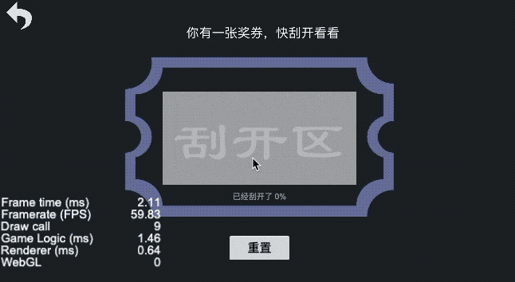
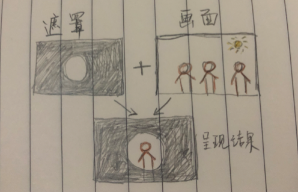
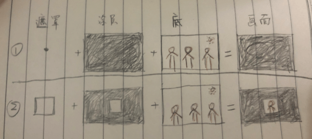
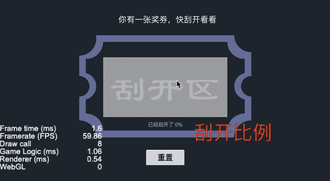

# 效果演示

奖券，优惠券什么的就需要用到刮刮卡的效果了，大家生活里都使用过。



# 实现思路

一个完整的刮刮卡需要有这三个功能，刮开涂层、刮开比例、重置。整个功能其实是对`mask`组件的一次深入应用。

## 刮开涂层

首先创立一个mask组件，长宽都设置为0，勾选反向遮罩，然后再拖一个涂层的`sprite`节点作为它的子节点。为什么这样做呢，我先介绍一下遮罩👇



上面可以很好地看明白，其实遮罩就是一个盖板，盖住了就看不到它的子节点了，但是如果我在遮罩中间掏个洞，那我就可以透过这个洞看到里面的东西。正向遮罩就是我看不到后面的东西，反向遮罩就是我可以看到后面的东西。如果我们把遮罩的长宽都设置为0，那等于这个遮罩什么用都没有，因为它的面积是0，所以它的子节点就能够完全暴露在画面上，所以我们能够看到涂层图片。

然后我们把刮的操作理解为更改这个遮罩的形状，本来它的面积是0，但是当用户刮的时候，我就给它赋予一个长宽，比如我把它的长宽变成10，那这个遮罩就从一个点（长宽为0）变成了一个长宽为10的正方形。而我们设置了这个遮罩类型为反向遮罩，所以我们就能透过这个正方形看到刮刮卡底层的内容了。这就解析了为什么我们需要勾选反向遮罩。这两步的图解如下👇




那问题来了，我在刮的时候，我生成的形状不能是矩形呀，我的动作是不规则的。其实mask是用Graphics实现的，刮的动作其实不就是在划线吗，所以每次刮的时候，我们只需要记录当前点和上一个点，调用`moveTo`和`lineTo`把用户的滑动轨迹画出来就可以了。我们在`touch_start`的时候只有一个点，那就用`circle`去画一个圆就可以了。代码如下：

```js
touchStartEvent(event) {
  let point = this.ticketNode.convertToNodeSpaceAR(event.getLocation());
  this.clearMask(point);
}

touchMoveEvent(event) {
  let point = this.ticketNode.convertToNodeSpaceAR(event.getLocation());
  this.clearMask(point);
}

tempDrawPoints: cc.Vec2[] = [];
  clearMask(pos) {
    let mask: any = this.maskNode.getComponent(cc.Mask);
    let stencil = mask._graphics;
    const len = this.tempDrawPoints.length;
    this.tempDrawPoints.push(pos);

    if (len <= 1) {
      // 只有一个点，用圆来清除涂层
      stencil.circle(pos.x, pos.y, CLEAR_LINE_WIDTH / 2);
      stencil.fill();

    } else {
      // 存在多个点，用线段来清除涂层
      let prevPos = this.tempDrawPoints[len - 2];
      let curPos = this.tempDrawPoints[len - 1];

      stencil.moveTo(prevPos.x, prevPos.y);
      stencil.lineTo(curPos.x, curPos.y);
      stencil.lineWidth = CLEAR_LINE_WIDTH;
      stencil.lineCap = cc.Graphics.LineCap.ROUND;
      stencil.lineJoin = cc.Graphics.LineJoin.ROUND;
      stencil.strokeColor = cc.color(255, 255, 255, 255);
      stencil.stroke();
    }
  }
```

## 统计刮开比例

上面解决了如何刮涂层，但是刮纯粹是图像上的操作，如何统计刮开比例呢。我采用的方法就是把遮罩分出N个小正方体，然后每次画的时候不是要动态去画圆和画线段吗，那顺便遍历一下这N个小正方体，如果正方体和里面包括圆心或者和线段有相交，那就把这个正方体标记一下。最后在`touch_end`的时候去统计已经标记过的正方体数量就可以统计出比例了。我还在代码里面留了个`debug`开关，开发的时候可以去实时查看是否有相交喔。



圆心点在正方形内是直接计算，线段和正方形相交是调用了`cc.Intersection.lineRect`方法，这块的代码如下：
```js
// 生成小格子，用来辅助统计涂层的刮开比例
for (let x = 0; x < this.ticketNode.width; x += CALC_RECT_WIDTH) {
  for (let y = 0; y < this.ticketNode.height; y += CALC_RECT_WIDTH) {
    this.polygonPointsList.push({
      rect: cc.rect(x - this.ticketNode.width / 2, y - this.ticketNode.height / 2, CALC_RECT_WIDTH, CALC_RECT_WIDTH),
      isHit: false
    });
  }
}

// 记录点所在的格子
this.polygonPointsList.forEach((item) => {
  if (item.isHit) return;
  const xFlag = pos.x > item.rect.x && pos.x < item.rect.x + item.rect.width;
  const yFlag = pos.y > item.rect.y && pos.y < item.rect.y + item.rect.height;
  if (xFlag && yFlag) item.isHit = true;
});

// 记录线段经过的格子
this.polygonPointsList.forEach((item) => {
  item.isHit = item.isHit || cc.Intersection.lineRect(prevPos, curPos, item.rect);
});
```

## 重置

重置格子，直接再生成一批就可以了。然后清除已画区域直接调用`Graphics`的`clear`方法就可以了

```js
polygonPointsList: { rect: cc.Rect; isHit: boolean }[] = [];
reset() {
  let mask: any = this.maskNode.getComponent(cc.Mask);
  mask._graphics.clear();

  this.tempDrawPoints = [];
  this.polygonPointsList = [];
  this.progerss.string = '已经刮开了 0%';
  this.ticketNode.getComponent(cc.Graphics).clear();

  // 生成小格子，用来辅助统计涂层的刮开比例
  for (let x = 0; x < this.ticketNode.width; x += CALC_RECT_WIDTH) {
    for (let y = 0; y < this.ticketNode.height; y += CALC_RECT_WIDTH) {
      this.polygonPointsList.push({
        rect: cc.rect(x - this.ticketNode.width / 2, y - this.ticketNode.height / 2, CALC_RECT_WIDTH, CALC_RECT_WIDTH),
        isHit: false
      });
    }
  }
}
```

# 效果预览

**源码**获取请点击**查看原文**，长按二维码**查看效果**👇


我是异名，你的阅读是我的动力


