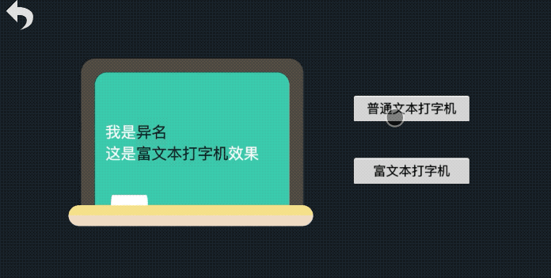
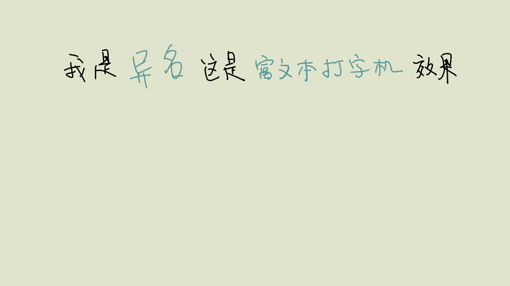
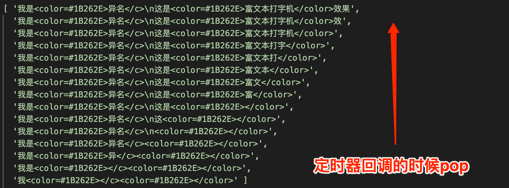

# 效果演示

打字机效果也就是让文字逐个在屏幕中显示，直到把整段话说完，常常被应用到人物对话，角色旁白甚至引导教程等高频场景中。



# 实现思路

文字逐一显示，其核心思路就是定时器的应用，对`label`组件而言，我们只需要在定时器的每次回调里面把字符逐一添加进去即可

```js
typerTimer: number = null; // 计时器Id
makeLaberTyper(str: string) {
  let charArr = str.split('');
  let charIdx = 0;

  this.typerTimer && clearInterval(this.typerTimer);
  this.typerTimer = setInterval(() => {
    if (charIdx >= charArr.length) {
      this.typerTimer && clearInterval(this.typerTimer);
    } else {
      charIdx += 1;
      this.label.string = charArr.slice(0, charIdx).join('');
    }
  }, 50);
}
```

但是对于富文本组件而言，我们就不能单纯地截取每个字符串然后再动态添加补充，因为富文本的字符串里面带有标签，单纯截取字符的方式无法保证标签的闭合，如果标签无法闭合，那呈现的字体效果就不是带有格式的富文本字段。所以要实现富文本的打字机效果，首先需要针对富文本进行文字提取，保留标签，然后再把文字动态塞到它原本存在的位置当中，这就转化成了一个简单的“找位置”问题，假定我们当前的富文本字符串如下：

`我是<color=#1B262E>异名</c>\n这是<color=#1B262E>富文本打字机</color>效果`

我们需要把字符串里面的标签找出来，然后替换成一个个容器，然后按顺序地往每个容器内添加文字，提炼和动态添加的过程如下所示



剩下的就是代码层面上的实现了，异名的做法是先一次性生成不同的字符串放在数组里面，然后在定时器的回调里面出栈：

```js
let str = '我是<color=#1B262E>异名</c>\n这是<color=#1B262E>富文本打字机</color>效果';
let charArr = str.replace(/<.+?\/?>/g, '').split('');
let tempStrArr = [str];

for (let i = charArr.length; i > 1; i--) {
  let curStr = tempStrArr[charArr.length - i];
  let lastIdx = curStr.lastIndexOf(charArr[i - 1]);
  let prevStr = curStr.slice(0, lastIdx);
  let nextStr = curStr.slice(lastIdx + 1, curStr.length);

  tempStrArr.push(prevStr + nextStr);
}
console.log(tempStrArr)
```



可以留意到字符片段里面也有换行符`\n`，虽然它是由两个字符组成，但是反斜杠是js里面的特殊字符，在字符串的处理中像`\n`、`\"`、`\\`等等都会被算作一个字符。


# 效果预览

**源码**获取请点击**查看原文**，长按二维码**查看效果**👇


我是异名，你的阅读是我的动力


