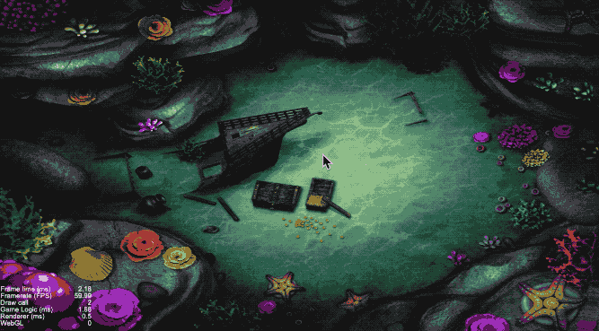
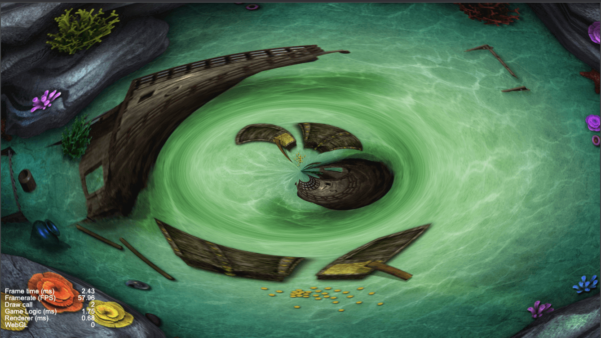
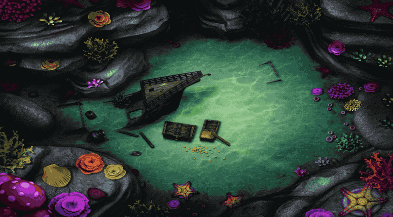
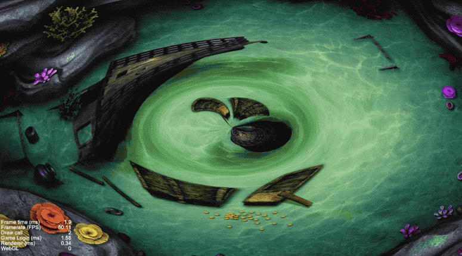
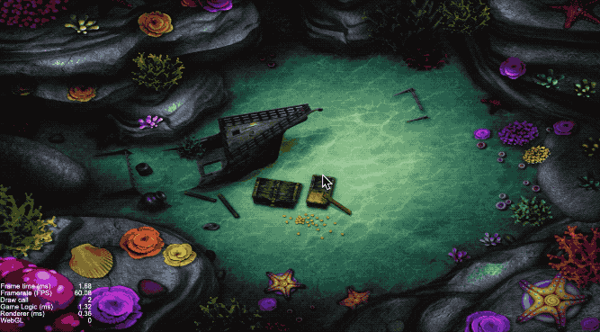

# 效果演示

水波扩散是一个比较好看的交互效果，特别是在某些以水为故事发生场景的游戏中，扩散的水波会让场景更加栩栩如生。



# 实现思路

如果水波静止，我们看到的其实是像素点围绕着某个中心点的拉伸效果，我们只需让每个像素点叠加上它和中心点的向量差，就能够呈现出画面上的所有像素围绕中心点的拉伸感。
```c++
void main() {
	vec2 uv = normalize(vec2(0.5, 0.5) - v_uv0) * 0.2 + v_uv0;
  gl_FragColor = texture(texture, uv);
}
```


这个时候如果我们加上时间参数，我们就可以得到一个往外不停井喷的“黑洞”：

```c++
void main() {
	vec2 uv = normalize(vec2(0.5, 0.5) - v_uv0) * 0.2 * cc_time.x + v_uv0;
  gl_FragColor = texture(texture, uv);
}
```



但是水波往外扩散是呼吸灯式的一波波往外涌，而且不是这种无尽式的一直把东西往外掏的感觉，所以我们要给`cc_time.x`加上一个周期性的变化，让它能表现出这种周期性的往外扩散的感觉。

```c++
void main() {
	vec2 uv = normalize(vec2(0.5, 0.5) - v_uv0) * 0.2 * sin(cc_time.x) + v_uv0;
  gl_FragColor = texture(texture, uv);
}
```


这种呼吸灯式的涌动其实和我们的最终效果有很大区别，因为它永远在循环涌动，但是我们的水波是从中心扩散出去之后，中间部分就不再动了的，怎么让中间的像素不再多次涌动呢？如果把一圈水波比作圆，那水波的扩散行为其实就是这个圆的半径在不断的增大，圆外面的波纹有效，圆里面的波纹静止。因此我们可以多加一个距离取样，像素离扩散中心的距离大于半径才保留否则丢弃，而这个半径从零开始逐渐增大。

```c++
void main() {
  vec2 distance_vec = vec2(0.5, 0.5) - v_uv0;
  float sin_factor = sin(cc_time.x) * 0.2;

  float wave_radius = 0.3;
  float distance = sqrt(distance_vec.x * distance_vec.x + distance_vec.y * distance_vec.y);
  // 其中waveOffset是随时间增长的，通过外部传入
  float dis_factor = clamp(wave_radius - abs(distance - wave_offset), 0.0, 1.0);

  vec2 uv = v_uv0 + normalize(distance_vec) * sin_factor * dis_factor;
  gl_FragColor = texture(texture, uv);
}
```



接下来的就是参数的调试，主要是三角函数的采样那里，我们希望水波能够产生多个波动，所以我们需要乘上一定的倍数，让函数的作用范围足够大，才能有足够多的波峰谷底。另外就是sin函数的输出值域在`(-1, 1)`之间，所以我们的输出也需要缩小一定的倍数，才能让函数的峰值变化处于一个合理的范围。

```c++
void main() {
  vec2 distance_vec = center - v_uv0;
  distance_vec = distance_vec * vec2(canvas_size.x / canvas_size.y, 1.0);
  float distance = sqrt(distance_vec.x * distance_vec.x + distance_vec.y * distance_vec.y);

  // distance小于1，但是我们希望能有多个波峰波谷，所以在sin的内部乘上一个比较大的倍数
  // sin函数的值在-1到1之间，我们希望偏移值很小，所以输出的时候需要缩小一定的倍数倍
  float sin_factor = sin(distance * 100.0 + cc_time.x) * 0.05;
  float discard_factor = clamp(wave_radius - abs(wave_offset - distance), 0.0, 1.0);

  // 计算总的uv的偏移值
  vec2 offset = normalize(distance_vec) * sin_factor * discard_factor;
  vec2 uv = offset + v_uv0;

  gl_FragColor = texture(texture, uv);
}
```


# 效果预览

**源码**获取请点击**查看原文**，长按二维码**查看效果**👇


我是异名，你的阅读是我的动力


